# RapidGuard - Always One Step Ahead


[](https://opensource.org/licenses/MIT)
[](github.com/kohnh/RapidGuard/graphs/contributors)

RapidGuard is an AI-powered disaster response system that delivers real-time hazard detection, dynamic emergency guidance, and interactive, context-aware updates, even when conventional analytics fall short under pressure.

## Table of Contents

- [Project Overview](#project-overview)
- [Setup Guide](#setup-guide)
- [User Guide](#user-guide)
- [Architecture](#architecture)
- [Contributing](#contributing)


## Project Overview

RapidGuard is a Nx Venue Innovation Hackathon  project designed to revolutionize disaster management in high-traffic venues by leveraging advanced AI for real-time hazard detection and integrating generative language models (LLMs) to provide actionable emergency response strategies. Traditional systems tend to be analytics-based and offer little in the way of immediate, practical steps—especially in rare, complex, and rapidly evolving disaster scenarios. Moreover, in high-pressure situations, it is extremely challenging for operators to derive effective solutions solely from static fire management SOPs, particularly when CCTV systems may have blindspots and staffing issues (e.g., a missing security guard).

RapidGuard addresses these challenges by continuously monitoring live CCTV feeds using a self-trained machine learning model built with Teachable Machine for fire detection. Upon identifying a potential hazard, it automatically activates a Disaster Response and Management System (DRMS) that uses LLMs to generate detailed, real-time emergency response plans. Furthermore, operators can interact directly with the LLM via a chat interface—allowing them to provide additional context such as updated fire conditions or on-the-ground insights. This extra context is automatically extracted from the user's input without requiring them to specify whether they are asking a question or merely adding unseen context from the CCTV feeds. The LLM then continuously refines and updates the response plan, ensuring that actionable guidance remains aligned with the evolving situation.

### Key Points

- **What it does:**  
  RapidGuard continuously monitors live CCTV feeds using a self-trained machine learning model built with Teachable Machine for fire and smoke detection. When a potential hazard is detected, it activates a DRMS that leverages LLMs to generate an initial emergency response plan and then dynamically updates the plan based on real-time changes in the situation. Operators can interact with the LLM via a chat interface, and any additional context provided is automatically integrated to refine the guidance.
  
- **Problem solved:**  
  Traditional surveillance systems and analytics-based solutions offer data without immediate, actionable steps, making it difficult for operators to respond effectively under stress. RapidGuard bridges this gap by automating hazard detection and translating complex SOPs into practical, adaptive instructions—even when blindspots or staffing issues occur.
  
- **Why it matters:**  
  By transforming raw analytics into dynamic, actionable emergency strategies and allowing for interactive, real-time updates, RapidGuard significantly improves situational awareness and decision-making during crises. This not only optimizes resource allocation and enhances safety in high-traffic venues but also ensures that on-ground input is seamlessly incorporated into evolving emergency plans, ultimately safeguarding lives and property.

### Demo Video

[](https://www.youtube.com/watch?v=VIDEO_ID)

## Setup Guide

Follow these step-by-step instructions to get the project up and running on your local machine.

### Prerequisites

- **Git:** [Download and install Git](https://git-scm.com/downloads)
- **Next.js:** [Download and install Node.js and npm](https://nodejs.org/en/download/)
- **Python:** [Download and install Python 3](https://www.python.org/downloads/)
- **Virtual Machine:** AWS EC2 Instance [t2.medium and above] (or any other cloud provider)

### Installation

1. **Clone the repository:**

   ```bash
   git clone https://github.com/kohnh/RapidGuard.git
   cd drms2
    ```

2. **Create a virtual environment:**

   ```bash
   cd backend
   python3 -m venv venv
   source venv/bin/activate
   ```

3. **Install the dependencies for backend:**

   ```bash
   pip install -r requirements.txt
   ```

4. **Install the dependencies for frontend:**

   ```bash
   cd ../frontend
   npm install
   ```

5. **Configure the environment:**

   Create .env file in the backend folder and add the following:

   ```bash
   cd ../backend
   OPENAI_API_KEY="your_openai_api_key"
   HOST_IP_ADDRESS="your_virtual_machine_ip_address"
   ```

   Transfer the run_script.sh file to the home directory and configure the crontab service:
   1. Edit the crontab file through this command
   ```bash
   crontab -e
   ```
   2. Paste the following into the crontab and save the changes made:
   ```bash
   * * * * * cd && /home/ubuntu/run_script.sh
   ```

6. **Download and Set Up NX Witness (Summary)**  

   Before proceeding with the following steps, ensure that the server is set up using the user guide. The user guide also contains useful illustrations for setting up NX Witness.  

   ### Install NX Witness  
   1. Download and install **NX Witness** from [this page](https://nxvms.com/download/releases/linux).  
   2. Open **NX Witness** and log in to your server using your credentials. If this is your first time connecting, enter the **server login details**.  
   3. Log in to **NX Cloud** by clicking the cloud icon in the top-right corner.  

   ### Deploy the Fire Detection Model via NX AI Manager  
   > Ensure the **NX Witness server** is set up before proceeding.  

   1. Select the **camera** where you want to deploy the AI model.  
   2. **Right-click** on the camera and select **Camera Settings**.  
   3. Navigate to the **Plugins Tab** and select **NX AI Manager**.  
   4. Activate **NX AI Manager**:  
      - Toggle the activation switch (this may take a few minutes).  
      - Change **Camera Stream** to **Secondary**.  
      - Ensure **Device Active** is enabled.  
   5. Deploy the **fire detection model**:  
      - Click **Manage Device** and wait for the data to load.  
      - Select **Add a new pipeline** and choose the desired model.  
      - Click **"Add to CAMERA_NAME pipeline"** and wait for deployment.  
      - *(Optional)* Add a **post-processing function** if needed.  
   6. Click **Apply**, then **OK** to save changes.  

   ### Configure Event Notification via (POST Request)  
   1. Select the **camera** running the AI model.  
   2. **Right-click** on the camera and select **Camera Rules**.  
   3. Add a **new camera rule**:  
      - Set the **URL** to the **IP address of the device running `server.py`**.  
      - Adjust the **POST request frequency** as needed.  
      - 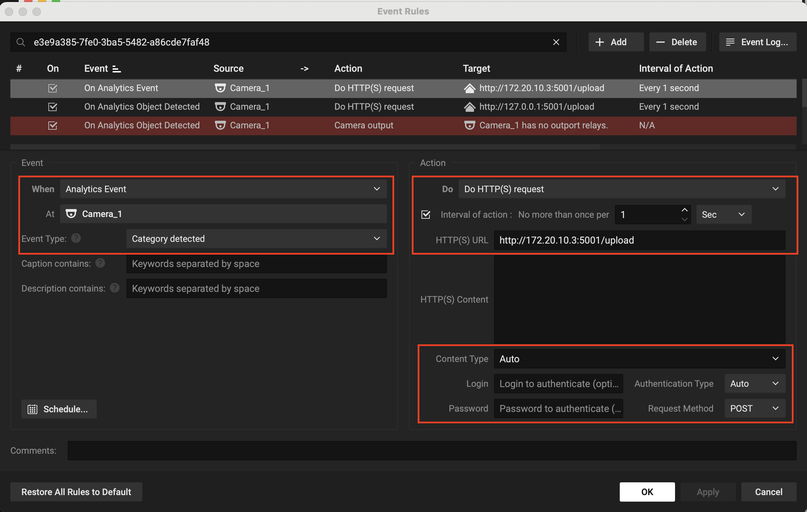  
   4. Click **Apply**, then **OK** to confirm the settings.  

7. **Download and Set Up NX Witness (Detailed)**

   <details>
   <summary>Step by step guide</summary>

      ### 1. Setting up the NX server

      1. Download and install the NX Witness server application that is suitable for your device from this webpage https://nxvms.com/download/releases/linux. This documentation uses the server version for Ubuntu Linux. 
      2. To illustrate the use of RapidGuard, a test camera will be used in this documentation. Download this video (https://sora.com/g/gen_01jn0fd8k2ekd80fxf02g5837p) onto the Ubuntu Server. Another way to transfer the video onto the server is to download the video on your personal device and copy it over to the server using the following command:

      ```bash
      1. cd $FOLDER_WHERE_THE_VIDEO_RESIDES
      2. sftp $USERNAME@NAME_OF_UBUNTU_SERVER
      3. put $NAME_OF_VIDEO
      4. exit
      ```

      3. To turn on the test camera, execute the following commands:
      ```bash
         1. cd /opt/networkoptix-metavms/mediaserver/bin
         2. ./testcamera files=/home/$USERNAME/$NAME_OF_VIDEO

      ```

      ### 2. Setting up NX Witness Client

      1. Download and install the NX Witness client application that is suitable for your device from this webpage https://nxvms.com/download/releases/linux
      2. Open the NX Witness application and log in to your server. If this is your first time connecting to the server, you will need to enter the login credentials for the server.


      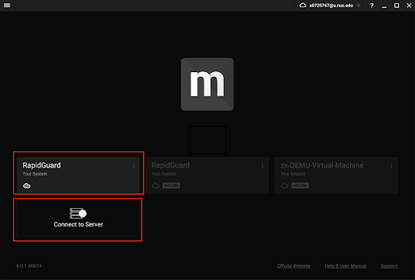

      3. Login to cloud by clicking onto the cloud icon located at the top right.


      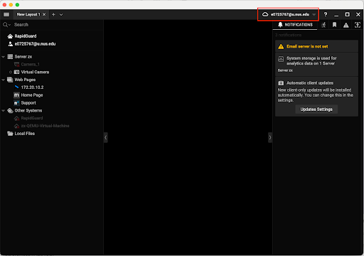

      4. Select the camera you wish to deploy the AI model on, right click on it and select Camera Settings


      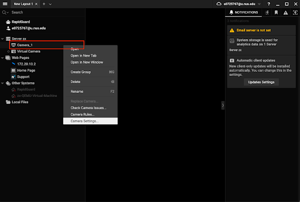

      5. Go to the Plugins Tab and select NX AI Manager, which is located on the left and perform the following: 
      a) Activate the NX AI Manager by toggling the switch
      b) Change Camera stream to secondary
      c) Ensure the Device Active switch is toggled 


      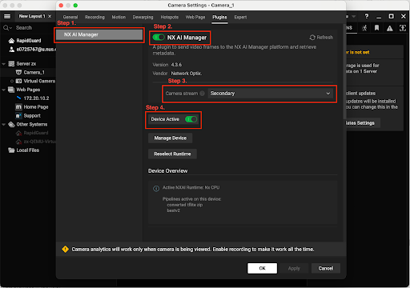

      6. If the AI Manager plugin is not available, install the AI manager manually by referring to this documentation. https://nx.docs.scailable.net/nx-ai-manager/4.-manual-plugin-installation. Install this package onto the server. 

      ### 3. Managing AI models using NX AI manager

      1. Go to this url: https://admin.sclbl.nxvms.com/ and key in your login credentials if you are prompted to do so. 
      2. Select the name of your server.


      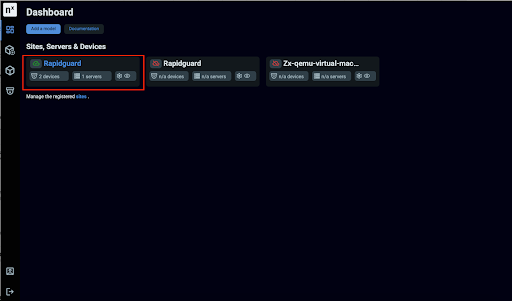

      3. Click on the model icon to view the list of models available. To upload a new model, select Add a new model


      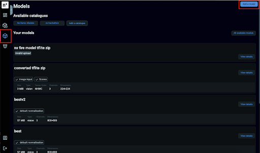

      4. Select teachable machines and upload the zip file in the machine_learning folder in this github repository - https://github.com/kohnh/RapidGuard. Amend the model name and description accordingly and select upload model located at the bottom of the page


      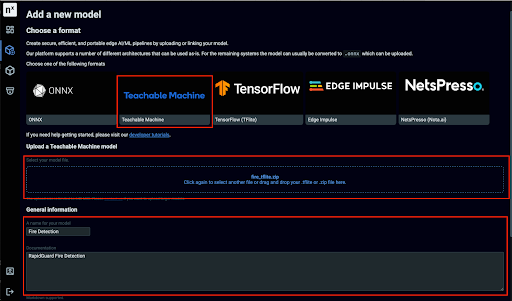

      5. You should see a notification on the top right corner that says that your model is converting. The conversion can take up to 10 mins.


      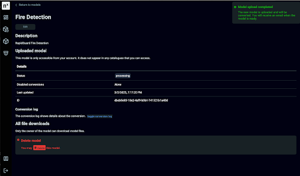

      6. This is what you can expect to see if the model conversion is valid


      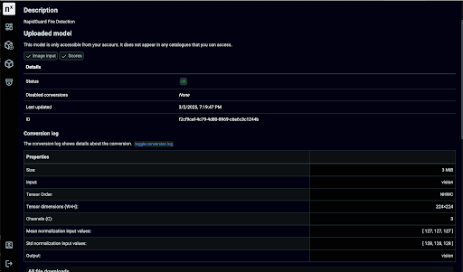


      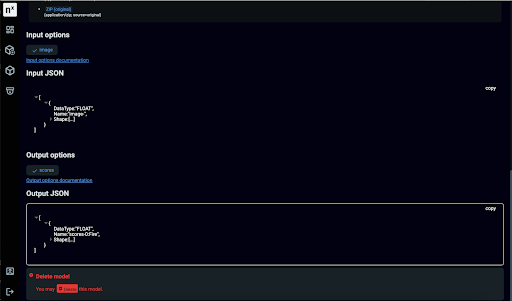

      7. To deploy the fire detection model that has been uploaded, perform the following steps:
      a) Go to your NX client application
      b) Select the camera, right click and select camera settings.
      c) Go to the Plugins tab and select Manage Device
      d) Select Add a new pipeline and look for the model you wish to add
      e) To add the model to the camera, select "Add to CAMERA_NAME pipeline" and wait for the model to be deployed
      f) Add a new post processing functionality if necessary
      g) Select "Apply" before clicking "Ok" to confirm the changes you made.


      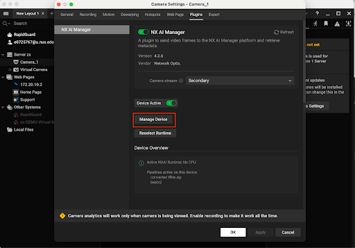


      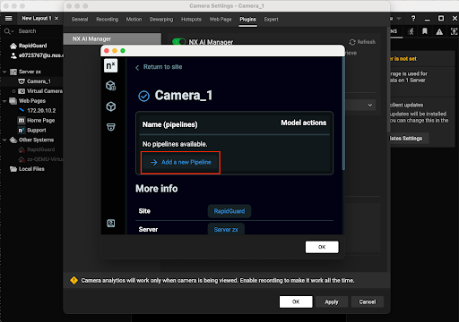


      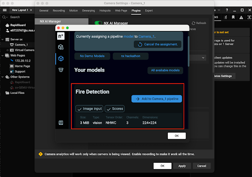


      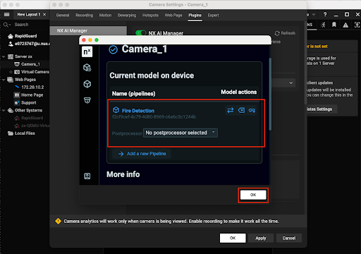


      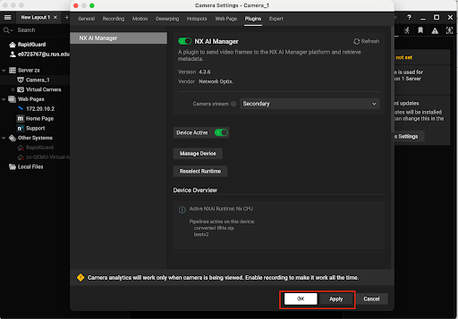

      ### 4. Configuring NX event rules

      To configure NX Witness to do a POST request to notify the server that a new event has been detected:
      Select the camera you wish to deploy the AI model on, right click on it and select Camera Rules


      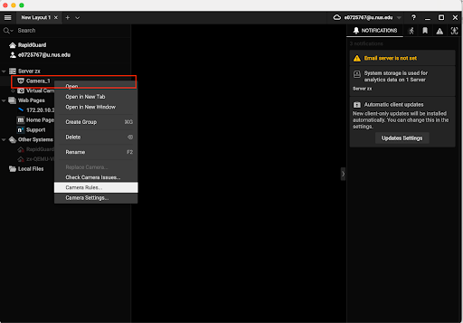

      Add a new camera rule and modify the configuration with respect to the following screenshot. 


      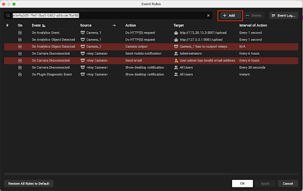


      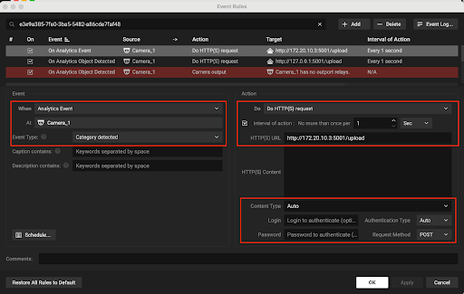

      The URL should be the ip address of the device server.py is running. Adjust the frequency of the POST request accordingly.

      Select "Apply" before clicking "Ok" to confirm the changes you made.


      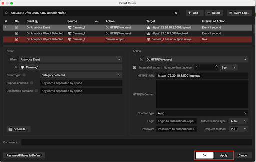

      Restart the test camera by using Ctrl C and rerunning the ./testcamera command. 
      If the event rules are configured correctly, this is what you should see in the events tab on the right panel:


      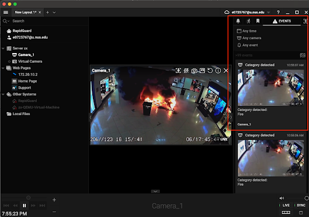
      </details>

## Running the Application

1. **On the same device that runs the NX Witness Client, perform the following:**  
   
   1. Download `server.py`.  
   2. Run the following commands:  

      ```bash
      pip install flask flask-cors requests urllib3
      python3 server.py
      ```

2. **Start backend services:**

   ```bash
   python -m gunicorn -k eventlet --workers 1 --bind 0.0.0.0:5000 main:app
   ```

3. **Start the frontend server:**

      ```bash
      cd ../frontend
      npm run dev
      ```

      Check the console to verify that socket connection is established.

      You should see a message like this:

      ```
      Socket connected with id: WqBZsZsGN0wLN0cMAAAB
      ```

4. **Access the application:**

    Go to web pages tab on NX Witness and access the application at `http://<HOST_IP_ADDRESS>:3000`.


## Architecture
Here is a high-level overview of the project architecture.

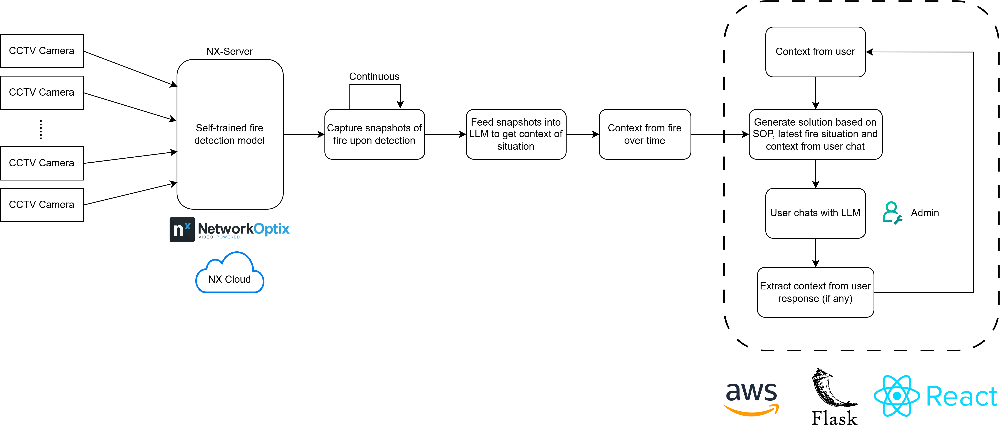


## User Guide
Here is a brief guide on how to use the application.


## Contributing
[](https://github.com/kohnh/RapidGuard/graphs/contributors) -->

<a href="https://github.com/thebadone231" target="_blank">
  
</a>
<a href="https://github.com/euzhengxi" target="_blank">
  
</a>
<a href="https://github.com/ong-ck" target="_blank">
  
</a>
<a href="https://github.com/kohnh" target="_blank">
  
</a>
